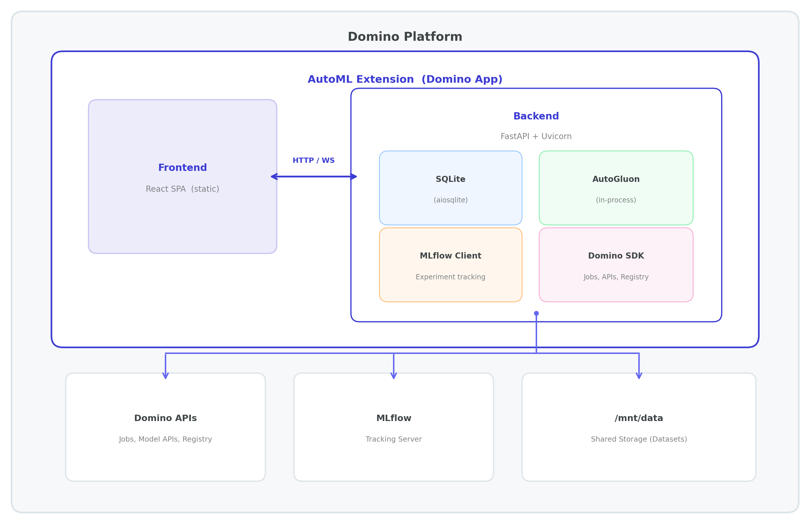
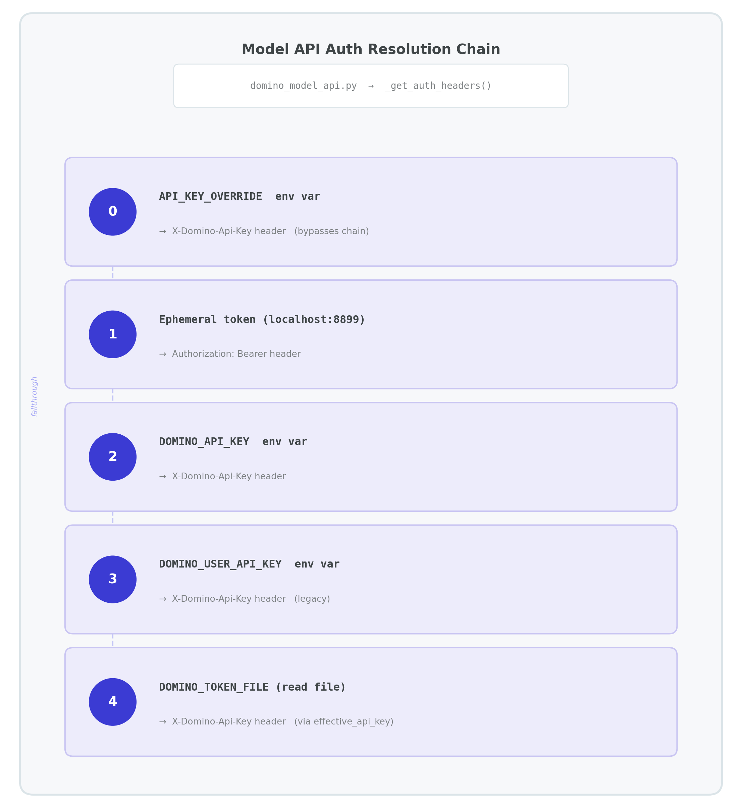

# AutoML Extension — Design Document

---

## 1. Problem Statement

Data analysts and business users often depend on centralized data science teams to build, evaluate, and deploy ML models. This bottleneck slows decision-making and limits who can leverage ML across the organization.

**AutoML** democratizes machine learning by providing a no-code interface for training, evaluating, and deploying models — directly inside Domino. The target persona is Domino users who need ML capabilities but aren't data scientists: analysts, domain experts, and business stakeholders.

---

## 2. Solution Overview

The AutoML Extension is a full-stack web application that runs as a Domino App. It guides users through the complete ML lifecycle without writing code.

### User Journey

```
  1. Upload / Select Data
          │
          ▼
  2. Exploratory Data Analysis (optional)
          │
          ▼
  3. Configure Training
          │
          ▼
  4. Train and Evaluate Models
          │
          ▼
  5. Deploy / Export
```

1. **Select data** — browse mounted Domino Datasets or upload CSV/Parquet files
2. **Explore** — automated data profiling (distributions, correlations, missing values) and time series analysis (ACF/PACF, stationarity, decomposition)
3. **Train** — configure target column, problem type, and time budget; AutoGluon trains and ensembles models
4. **Evaluate** — leaderboard, feature importance, SHAP explanations, residual plots
5. **Deploy / Export** — three paths to production:
   - **Model API** — create Domino Model APIs with versioning, scaling, and lifecycle management (start/stop, logs, credentials)
   - **Model Registry** — push to MLflow/Domino Model Registry with version control, stage transitions (Staging → Production → Archived), and model cards
   - **Export** — download as a deployment package or reproducible Jupyter notebook for offline or external use

### Architecture (High-Level)




---

## 3. Architecture & Design

### 3.1 Frontend

| Aspect | Detail |
|--------|--------|
| Framework | React 18 + TypeScript 5.9 |
| Build tool | Vite 5 |
| Styling | Tailwind CSS 3.4 with Domino design tokens (`domino-*`) |
| State | Zustand (client), TanStack React Query (server) |
| Routing | React Router v6 with dynamic `basename` detection |
| API layer | RESTful `/svc/v1/*` paths via fetch with runtime base path detection |


### 3.2 Backend

| Aspect | Detail |
|--------|--------|
| Framework | FastAPI (async) on Uvicorn |
| Python | 3.10+ |
| Database | SQLite via SQLAlchemy 2.0 + aiosqlite (async) |
| ML engine | AutoGluon 1.1+ (tabular + time series) |
| HTTP client | httpx (async) for Domino API calls |
| Domino SDK | python-domino 1.2+ for job launch/status/stop |

**Route structure** — 8 RESTful routers mounted at multi-segment prefixes:

| Router | Prefix | 
|--------|--------|
| Health | `/svc/v1/health` |
| Jobs | `/svc/v1/jobs` |
| Datasets | `/svc/v1/datasets` |
| Predictions | `/svc/v1/predictions` | 
| Profiling | `/svc/v1/profiling` | 
| Registry | `/svc/v1/registry` | 
| Export | `/svc/v1/export` | 
| Deployments | `/svc/v1/deployments` | 

Plus 1 WebSocket endpoint (`/ws/jobs/{job_id}`) for real-time job progress.

**Singleton services** — Stateful components (job queue, model cache, WebSocket manager) are instantiated as singletons via `@lru_cache()` on factory functions.

---

## 4. Domino Integration Surface

This section details everything the extension requires from the Domino platform.

### 4.1 Environment Variables

> **Criticality levels**:
> - **Required** — App cannot function in Domino without this. Framework must inject it.
> - **Recommended** — Core features degrade without this. Framework should inject it.
> - **Optional** — Enables specific features or overrides defaults. Inject if applicable.

#### Identity & Project Context

| Variable | Source | Criticality | Default | Purpose | When Missing |
|----------|--------|-------------|---------|---------|-------------|
| `DOMINO_PROJECT_NAME` | Domino | Required | `None` | Project name; primary value for storage path scoping | — |
| `DOMINO_PROJECT_ID` | Domino | Recommended | `None` | Project identifier for API calls (jobs, deployments) | External job submission and Model API creation fail (`ValueError` raised). |
| `DOMINO_PROJECT_OWNER` | Domino | Recommended | `None` | Project owner username | External job submission fails (`ValueError` raised). Job overview links to Domino UI and Experiment Manager return `None`. |
| `DOMINO_RUN_ID` | Domino | Recommended | `None` | Current run/workspace ID; used to detect Domino runtime | Domino runtime detection falls back to `/mnt/data` directory presence check. MLflow training runs lose the `domino.run_id` tag. Storage paths degrade to `./local_data/` if `/mnt/data` also absent. |
| `DOMINO_STARTING_USERNAME` | Domino | Optional | `None` | Username of the user who started the run | Logged as empty string in MLflow run tag (`domino.user`); training proceeds normally. |

#### Authentication

| Variable | Source | Criticality | Default | Purpose | When Missing |
|----------|--------|-------------|---------|---------|-------------|
| `DOMINO_API_HOST` | Domino | Required | `None` | Domino API base URL (e.g., `https://my-domino.example.com`) | — |
| `DOMINO_API_KEY` | Extension | Required* | `None` | Primary API key for Domino REST API calls | — |
| `DOMINO_USER_API_KEY` | Domino (legacy) | Optional | `None` | Legacy API key (fallback) | Skipped; auth chain continues to `DOMINO_TOKEN_FILE` → ephemeral token. |
| `DOMINO_TOKEN_FILE` | Domino | Optional | `None` | Path to file containing a Domino auth token (fallback) | Skipped; auth chain continues to API key → ephemeral token. |
| `DOMINO_API_PROXY` | Domino (Apps only) | Optional | `None` | Domino API proxy endpoint; used inside Domino Apps | Must configure explicit `DOMINO_API_KEY` + `DOMINO_API_HOST` instead. |
| `API_KEY_OVERRIDE` | Extension | Optional | `None` | Overrides entire auth chain for the Model API client | Normal auth resolution chain is used. |

\*At least one of `DOMINO_API_KEY`, `DOMINO_USER_API_KEY`, `DOMINO_TOKEN_FILE`, or `DOMINO_API_PROXY` must be set for any Domino integration to work.

**Auth resolution order** (Model API client): `API_KEY_OVERRIDE` → ephemeral token from `localhost:8899` → `DOMINO_API_KEY` → `DOMINO_USER_API_KEY` → contents of `DOMINO_TOKEN_FILE`

#### Compute Configuration

| Variable | Source | Criticality | Default | Purpose | When Missing |
|----------|--------|-------------|---------|---------|-------------|
| `DOMINO_TRAINING_HARDWARE_TIER_NAME` | Extension | Optional | `None` | Hardware tier for external training jobs | Uses project default tier; can be overridden per-job in the UI. |
| `DOMINO_TRAINING_ENVIRONMENT_ID` | Extension | Optional | `None` | Environment ID for training job containers | Uses project default environment — **training fails if default lacks AutoGluon**. |
| `DOMINO_EDA_HARDWARE_TIER_NAME` | Extension | Optional | `None` | Hardware tier for external EDA jobs | Uses project default tier; can be overridden per-request. |
| `DOMINO_EDA_ENVIRONMENT_ID` | Extension | Optional | `None` | Environment ID for EDA job containers | Uses project default environment. |
| `DOMINO_MODEL_API_ENVIRONMENT_ID` | Extension | Optional | `None` | Environment ID for Model API creation | Falls through: `DOMINO_TRAINING_ENVIRONMENT_ID` → `DOMINO_ENVIRONMENT_ID` → `DOMINO_EDA_ENVIRONMENT_ID` → project default (via API). |
| `DOMINO_ENVIRONMENT_ID` | Domino | Optional | `None` | General fallback environment ID (used in Model API environment resolution chain) | Skipped in resolution chain; continues to next fallback. |
| `AUTOML_SERVICE_DIR` | Extension | Optional | `None` | Base directory for the automl-service code (used for runner path construction in job launcher) | Defaults to auto-detected service directory. |

**Environment ID resolution for Model APIs**: explicit param → `DOMINO_MODEL_API_ENVIRONMENT_ID` → `DOMINO_TRAINING_ENVIRONMENT_ID` → `DOMINO_ENVIRONMENT_ID` → `DOMINO_EDA_ENVIRONMENT_ID` → project default (via API)

#### Link Generation

| Variable | Source | Criticality | Default | Purpose | When Missing |
|----------|--------|-------------|---------|---------|-------------|
| `DOMINO_EXTERNAL_HOST` | Domino | Optional | `None` | External Domino host for generating user-facing links (e.g., job overview, experiment links) | Falls back to `DOMINO_LINK_HOST` → `DOMINO_USER_HOST` → `DOMINO_API_HOST`. |
| `DOMINO_LINK_HOST` | Domino | Optional | `None` | Domino host for link generation (fallback) | Falls back to `DOMINO_USER_HOST` → `DOMINO_API_HOST`. |
| `DOMINO_USER_HOST` | Domino | Optional | `None` | User-facing Domino host | Falls back to `DOMINO_API_HOST`. |

#### Storage Paths

| Variable | Source | Criticality | Default | Purpose | When Missing |
|----------|--------|-------------|---------|---------|-------------|
| `DOMINO_DATASET_MOUNT_PATH` | Extension | Optional | (see below) | Comma-separated list of dataset mount paths | Scans defaults: `/domino/datasets/local`, `/mnt/data`, `/mnt/imported/data`. |
| `DOMINO_MOUNT_PATHS` | Extension | Optional | (see below) | Additional mount paths (appended to above) | Same defaults as above. |

When neither env var is set, defaults to: `/domino/datasets/local`, `/mnt/data`, `/mnt/imported/data`

#### MLflow

| Variable | Source | Criticality | Default | Purpose | When Missing |
|----------|--------|-------------|---------|---------|-------------|
| `MLFLOW_TRACKING_URI`  `MLFLOW_TRACKING_TOKEN` `MLFLOW_ENABLE_PROXY_MULTIPART_UPLOAD` `MLFLOW_MULTIPART_UPLOAD_CHUNK_SIZE`| Domino | Recommended | `None` | MLflow tracking server URI | Experiment tracking is offline-only (local MLflow backend). Model Registry page is non-functional. Job overview cannot generate experiment links. |


#### Git / Commit

| Variable | Source | Criticality | Default | Purpose | When Missing |
|----------|--------|-------------|---------|---------|-------------|
| `DOMINO_JOB_COMMIT_ID` | Extension | Optional | `None` | Explicit commit for child job launches (highest priority) | Falls through to `DOMINO_STARTING_COMMIT_ID` → `git rev-parse HEAD` → `None`. |
| `DOMINO_STARTING_COMMIT_ID` | Domino | Optional | `None` | Commit at workspace/run start | Falls back to `git rev-parse HEAD` → `None`. |

**Commit resolution order**: `DOMINO_JOB_COMMIT_ID` → `DOMINO_STARTING_COMMIT_ID` → `git rev-parse HEAD`

### 4.2 Domino APIs Called

#### Direct REST API Calls

| # | Method | Endpoint | Purpose | Source File |
|---|--------|----------|---------|-------------|
| 1 | GET | `http://localhost:8899/access-token` | Acquire ephemeral Domino access token | `domino_model_api.py` |
| 2 | GET | `/v4/projects/{projectId}/settings` | Resolve default environment ID | `domino_model_api.py` |
| 3 | GET | `/api/datasetrw/v1/datasets/{datasetId}` | Get dataset metadata | `dataset_manager.py` |

**Model Serving API** (`domino_model_api.py`) — deploy-from-job flow:

| # | Method | Endpoint | Purpose |
|---|--------|----------|---------|
| 4 | POST | `/api/modelServing/v1/modelApis` | Create Model API |
| 5 | POST | `.../modelApis/{id}/versions` | Create version |
| 6 | POST | `/api/modelServing/v1/modelDeployments` | Create deployment |

> The backend client (`domino_model_api.py`) implements the full Model Serving CRUD surface (19 endpoints) for future use; only the create flow above is UI-reachable today.

#### python-domino SDK Calls

| SDK Method | Underlying API | Purpose | Source File |
|------------|----------------|---------|-------------|
| `Domino.job_start(...)` | `POST /v4/jobs/start` | Launch training/EDA job | `domino_job_launcher.py` |
| `Domino.job_status(id)` | `GET /v4/jobs/{id}/status` | Check job status | `domino_job_launcher.py` |
| `Domino.job_stop(id)` | `POST /v4/jobs/{id}/stop` | Cancel running job | `domino_job_launcher.py` |

#### MLflow / Model Registry

| Operation | Purpose | Source File |
|-----------|---------|-------------|
| `mlflow.set_experiment()` | Create/select experiment | `domino_registry.py` |
| `mlflow.start_run()` + `log_param/metric/artifacts` | Log training run | `domino_registry.py` |
| `mlflow.register_model()` | Register model version | `domino_registry.py` |
| `MlflowClient.search_registered_models()` | List registered models | `domino_registry.py` |
| `MlflowClient.search_model_versions()` | List model versions | `domino_registry.py` |
| `MlflowClient.transition_model_version_stage()` | Promote/archive versions | `domino_registry.py` |
| `MlflowClient.delete_model_version()` | Delete version | `domino_registry.py` |
| `MlflowClient.delete_registered_model()` | Delete model | `domino_registry.py` |
| `mlflow.artifacts.download_artifacts()` | Download model artifacts | `domino_registry.py` |

### 4.3 HTTP Headers

| Header | Injected By | Purpose |
|--------|-------------|---------|
| `domino-username` | Domino nginx proxy | Identifies the current user; used for job ownership and scoping |

Fallback: `"anonymous"` when the header is absent (local development).

### 4.4 Authentication Flow

The extension supports multiple auth mechanisms to work across Domino contexts (Apps, Workspaces, Jobs):




The `python-domino` SDK client has its own resolution order: `DOMINO_API_PROXY` → `DOMINO_TOKEN_FILE` → `DOMINO_USER_API_KEY` → `effective_api_key` as bearer token.

---

## 5. Data Storage & Filesystem

### 5.1 Storage Layout

All persistent data is stored under a project-scoped directory on `/mnt/data`:

```
/mnt/data/<sanitized_project_name>/
├── automl.db        # SQLite database (job metadata, model records)
├── models/          # Trained model artifacts (AutoGluon output)
├── datasets/        # Copied/processed dataset files
│   └── uploads/     # Staged uploaded files
├── uploads/         # Direct file uploads
├── temp/            # Scratch space (cleaned periodically)
└── eda_results/     # Async EDA profiling results
```

`<sanitized_project_name>` is derived from `DOMINO_PROJECT_NAME` → `"default_project"`, with non-alphanumeric characters stripped.

### 5.2 Dataset Mount Resolution

The extension discovers available datasets by scanning mount paths in priority order:

1. **`DOMINO_DATASET_MOUNT_PATH`** — explicit paths (comma/semicolon separated)
2. **`DOMINO_MOUNT_PATHS`** — additional paths (appended)
3. **Hardcoded defaults** (when no env vars set):
   - `/domino/datasets/local` (DFS-backed projects)
   - `/mnt/data` (Git-based projects)
   - `/mnt/imported/data` (shared/imported datasets)
4. **Fallback** — the project's own datasets directory

Only paths that exist on disk are used. Supported file formats: `.csv`, `.parquet`, `.pq`.

Dataset IDs use a prefix scheme:
- `local:<filename>` — files in the project datasets directory
- `domino:<name>` — files found on Domino dataset mount paths
- UUID — resolved via the Domino Dataset API, then located on mount paths

### 5.3 Persistence Model

| State | Persistent? | Location | Survives Restart? |
|-------|-------------|----------|-------------------|
| SQLite database | Yes | `/mnt/data/<project>/automl.db` | Yes |
| Trained models | Yes | `/mnt/data/<project>/models/` | Yes |
| Uploaded files | Yes | `/mnt/data/<project>/uploads/` | Yes |
| EDA results | Yes | `/mnt/data/<project>/eda_results/` | Yes |
| In-memory job queue | No | Process memory | No |
| Loaded model cache | No | Process memory | No |
| WebSocket connections | No | Process memory | No |

---

## 6. ML Lifecycle

| Stage | Description | Domino Integrations |
|-------|-------------|---------------------|
| **EDA** | Automated data profiling — distributions, correlations, missing values, time series analysis (ACF/PACF, ADF test, decomposition) | In-process compute or external Domino Job (via `python-domino`) |
| **Training** | AutoGluon trains and ensembles multiple models (XGBoost, LightGBM, neural nets, etc.) within a configurable time budget | In-process async queue or external Domino Job; hardware tier and environment configurable via env vars |
| **Evaluation** | Leaderboard with model comparison, feature importance, SHAP explanations (when available), confusion matrices, residual plots | Results stored in SQLite and on filesystem |
| **Registry** | Register trained models to Domino Model Registry via MLflow | MLflow tracking server (`MLFLOW_TRACKING_URI`), experiment logging, model artifact upload |
| **Deployment** | One-click deploy from a completed training job — creates Model API, version, and deployment in a single flow | Model Serving API (3 create endpoints), environment resolution; backend client covers 19 endpoints for future lifecycle management |

---

## 7. Deployment Model

### 7.1 Current Model

The extension runs as a single Docker container serving both frontend and backend:

```
app.sh --all (default)
  ├── npm run build          # Build React SPA → dist/
  ├── write dist/config.js   # Runtime config (API host, base path)
  └── uvicorn app.main:app   # Serve API + static files on port 8888
```

`app.sh` supports four modes:

| Mode | Flag | Use Case |
|------|------|----------|
| Combined | `--all` (default) | Production: builds frontend, serves everything on one port |
| Backend only | `--backend` | When frontend is served separately |
| Frontend only | `--frontend` | Vite dev server for frontend development |
| Dev | `--dev` | Backend + Vite dev server with HMR |

The script auto-installs Node.js 20 if not present and bootstraps lightweight pip dependencies at startup.

### 7.2 Key Dependencies

**Backend (Python 3.10+)**:

| Package | Version | Purpose |
|---------|---------|---------|
| FastAPI | ≥0.109 | Web framework |
| uvicorn | ≥0.27 | ASGI server |
| SQLAlchemy | ≥2.0 | ORM + async DB |
| aiosqlite | ≥0.19 | Async SQLite driver |
| AutoGluon (tabular + timeseries) | ≥1.1 | ML engine |
| MLflow | ≥2.10 | Experiment tracking + model registry |
| python-domino | ≥1.2 | Domino SDK (job launch, auth) |
| httpx | ≥0.26 | Async HTTP client |
| Pydantic | ≥2.5 | Request/response validation |
| pandas | ≥2.0 | Data manipulation |
| statsmodels | ≥0.14 | Time series analysis |

**Frontend (Node.js 18+)**:

| Package | Version | Purpose |
|---------|---------|---------|
| React | 18.2 | UI framework |
| Vite | 5.0 | Build tool |
| TypeScript | 5.9 | Type system |
| Tailwind CSS | 3.4 | Styling |
| TanStack React Query | 5.17 | Server state |
| Zustand | 4.4 | Client state |
| React Router | 6.21 | Routing |
| Recharts | 2.10 | Charts |

### 7.3 Migration Notes for Extensions Framework

These are the key integration points the Extensions framework needs to address:

| Area | Current Behavior | Framework Implication |
|------|-----------------|----------------------|
| **Proxy routing** | RESTful multi-segment paths (`/svc/v1/*`) used directly; Domino proxy confirmed to support multi-segment routing | Framework should support multi-segment path forwarding |
| **Env var contract** | ~30 env vars across 6 categories (see Section 4.1) | Framework should define which env vars are injected and guarantee their availability |
| **Authentication** | 5-step fallback chain across multiple mechanisms | Framework should provide a single, consistent auth mechanism |
| **Storage isolation** | Project-scoped paths under `/mnt/data/<project>/` | Framework should define storage contracts and persistence guarantees |
| **Job execution** | Extension launches child Domino Jobs via `python-domino` SDK | Framework needs to support or mediate child job launches |
| **Model API integration** | Extension creates/manages Model APIs via Model Serving REST API | Framework needs to allow extensions to create Model APIs |
| **WebSocket support** | Real-time progress updates via `ws://` at `/ws/jobs/{job_id}` | Framework's proxy must support WebSocket upgrade |
| **Statefulness** | SQLite on `/mnt/data` + in-memory job queue | Framework should clarify persistence guarantees and restart behavior |
| **User identity** | `domino-username` header injected by proxy | Framework should guarantee this header for user-scoped operations |
| **Base path detection** | Runtime URL pattern matching for Apps vs. Workspace proxy | Framework should provide a consistent base path mechanism |

---

## 8. Requirements & Assumptions

For the AutoML Extension to function correctly on the Extensions framework:

**Must have**:
- `/mnt/data` must be writable and persistent across app restarts
- Domino proxy must support multi-segment paths (`/svc/v1/*`)
- `domino-username` header must be injected by the proxy for all requests
- Ephemeral token endpoint (`localhost:8899`) must be available for app-internal auth
- Dataset mounts must be readable at known paths (`/domino/datasets/local`, `/mnt/data`, `/mnt/imported/data`)
- The app must know its project context (`DOMINO_PROJECT_ID`, `DOMINO_PROJECT_NAME`, `DOMINO_PROJECT_OWNER`) at startup
- `DOMINO_API_HOST` must be set for any Domino API calls to work
- WebSocket connections must not be terminated by the proxy

**Should have**:
- `python-domino` SDK available in the runtime environment (for external job execution)
- `MLFLOW_TRACKING_URI` and token injected if experiment tracking is desired
- Hardware tier and environment IDs configurable via env vars for job and Model API creation
- Git commit ID available for child job launches (via env var or `git rev-parse`)

**Nice to have**:
- A standardized auth mechanism that eliminates the need for multiple fallback chains
- Framework-provided base path detection (removing the need for runtime URL pattern matching)
- A defined extension manifest format for declaring required env vars, storage, and API access
